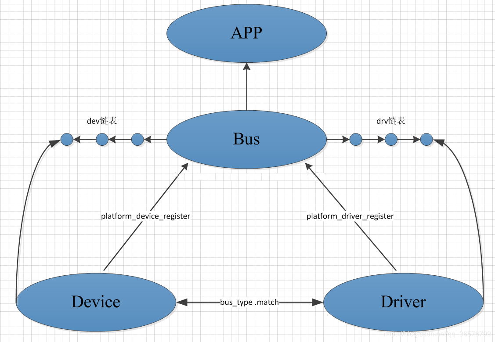
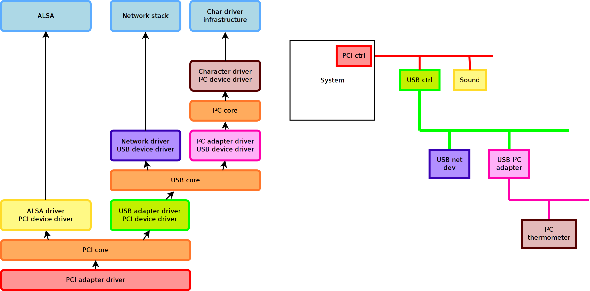
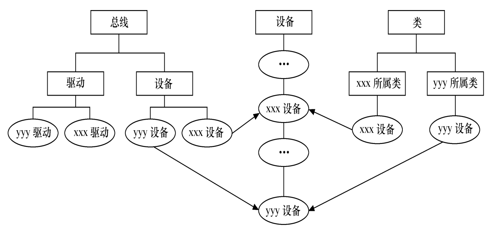
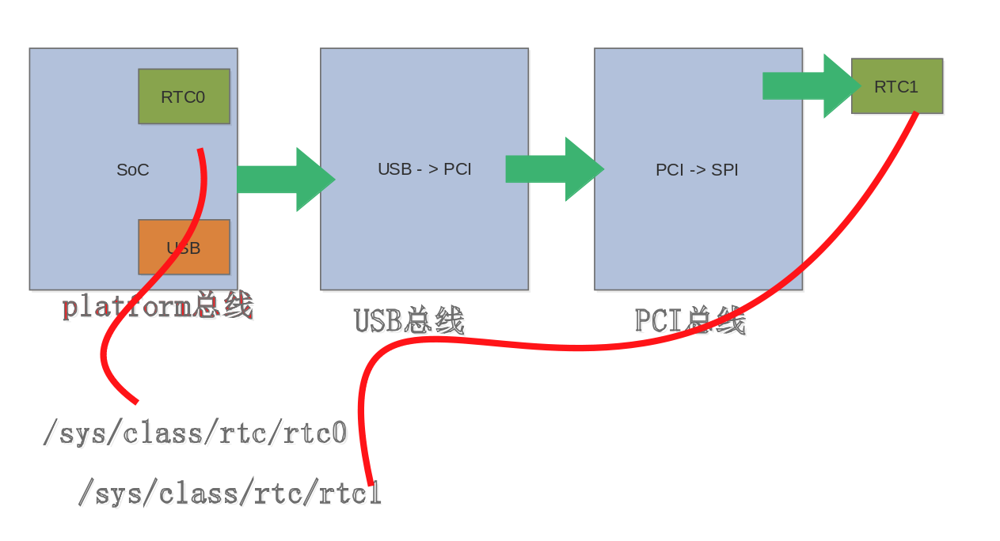
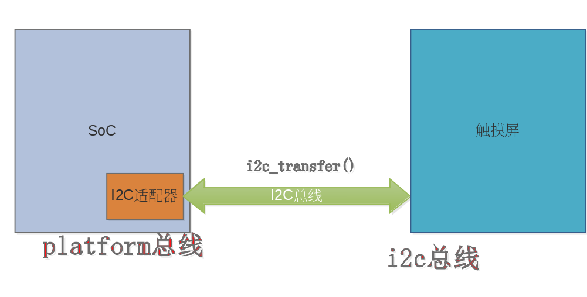
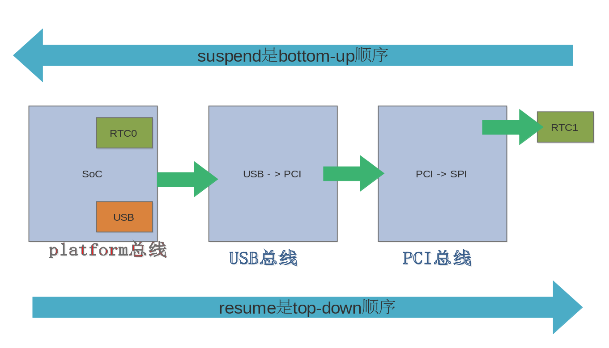

# Bus Device Driver

## 总线、设备、驱动

| 实体      | 功能           | 代码  |
| -------- |:-------------:| -----:|
| 设备      | 描述基地址、中断号、时钟、DMA、复位等信息 | arch/arm arch/blackfin  arch/xxx  等目录 |
| 驱动      | 完成外设的功能，如网卡收发包，声卡录放，SD卡读写…      |  drivers/* 等目录 |
| 总线      | 完成设备和驱动的关联      |   drivers/base/platform.c drivers/pci/pci-driver.c … |

## globalfifo

通过系统上的目录可以查看相应的信息：

```bash
/sys/bus/platform/devices/
/sys/bus/platform/drivers/
```

## [platform 平台总线驱动模型]

从Linux2.6开始Linux加入了一套驱动管理和注册机制— platform 平台总线驱动模型。platform 平台总线是一条虚拟总线， platform_device 为相应的设备， platform_driver 为相应的驱动。与传统的 bus/device/driver 机制相比， platform 由内核统一进行管理，提高了代码的可移植性和安全性。所谓的 platform_device 并不是与字符设备、块设备和网络设备并列的概念，而是Linux系统提供的一种附加手段。

Linux总线设备驱动模型的框架如下图所示：





在总线设备驱动模型中，需关心**总线、设备和驱动**这3个实体，**总线**将**设备和驱动**绑定。当系统向内核注册每一个驱动程序时，都要通过调用 platform_driver_register 函数将驱动程序注册到**总线**，并将其放入所属**总线**的 **drv链表**中，注册驱动的时候会调用所属**总线的match函数**寻找该总线上与之**匹配的每一个设备**，如果找到与之匹配的设备则会调用相应的**probe函数**将相应的设备和驱动进行绑定； 同样的当系统向内核注册每一个设备时，都要通过调用platform_device_register 函数将设备注册到总线，并将其放入所属总线的**dev链表中**，注册设备的时候同样也会调用所属**总线的match函数**寻找该总线上与之匹配的每一个驱动程序，如果找到与之匹配的**驱动程序时会调用相应的probe函数**将相应的设备和驱动进行绑定；而这一匹配的过程是由总线自动完成的。


```c
platform_driver_register(drv)
    __platform_driver_register(drv, THIS_MODULE)
        driver_register(&drv->driver)
            bus_add_driver(drv)
                driver_attach(drv)
                    bus_for_each_dev(drv->bus, NULL, drv, __driver_attach);
                    __driver_attach(dev, data);
                        driver_match_device(drv, dev);
                        driver_probe_device(drv, dev);
                            really_probe(dev, drv);
                                dev->bus->probe(dev); or drv->probe(dev);
```

1. 下面分析 platform 驱动相关的结构体

```C
struct platform_driver {
        int (*probe)(struct platform_device *);
        int (*remove)(struct platform_device *);
        void (*shutdown)(struct platform_device *);
        int (*suspend)(struct platform_device *, pm_message_t state);
        int (*resume)(struct platform_device *);
        struct device_driver driver;
        const struct platform_device_id *id_table;
        bool prevent_deferred_probe;
};
```

首先分析 platform_driver_register 用到的 platform_driver 结构体，其中包含了 probe 和 remove 等相关操作， 同时还内嵌了device_driver 结构体，下面看看这个结构体中都有什么内容：

```c
/**
 * struct device_driver - The basic device driver structure
 * @name:       Name of the device driver.
 * @bus:        The bus which the device of this driver belongs to.
 * @owner:      The module owner.
 * @mod_name:   Used for built-in modules.
 * @suppress_bind_attrs: Disables bind/unbind via sysfs.
 * @probe_type: Type of the probe (synchronous or asynchronous) to use.
 * @of_match_table: The open firmware table.
 * @acpi_match_table: The ACPI match table.
 * @probe:      Called to query the existence of a specific device,
 *              whether this driver can work with it, and bind the driver
 *              to a specific device.
 * @remove:     Called when the device is removed from the system to
 *              unbind a device from this driver.
 * @shutdown:   Called at shut-down time to quiesce the device.
 * @suspend:    Called to put the device to sleep mode. Usually to a
 *              low power state.
 * @resume:     Called to bring a device from sleep mode.
 * @groups:     Default attributes that get created by the driver core
 *              automatically.
 * @pm:         Power management operations of the device which matched
 *              this driver.
 * @p:          Driver core's private data, no one other than the driver
 *              core can touch this.
 *
 * The device driver-model tracks all of the drivers known to the system.
 * The main reason for this tracking is to enable the driver core to match
 * up drivers with new devices. Once drivers are known objects within the
 * system, however, a number of other things become possible. Device drivers
 * can export information and configuration variables that are independent
 * of any specific device.
 */

struct device_driver {
        const char              *name;
        struct bus_type         *bus;

        struct module           *owner;
        const char              *mod_name;      /* used for built-in modules */

        bool suppress_bind_attrs;       /* disables bind/unbind via sysfs */
        enum probe_type probe_type;

        const struct of_device_id       *of_match_table;
        const struct acpi_device_id     *acpi_match_table;

        int (*probe) (struct device *dev);
        int (*remove) (struct device *dev);
        void (*shutdown) (struct device *dev);
        int (*suspend) (struct device *dev, pm_message_t state);
        int (*resume) (struct device *dev);
        const struct attribute_group **groups;

        const struct dev_pm_ops *pm;

        struct driver_private *p;
};
```

这个结构体中包含了很多东西，包括所属的总线，模块名字，设备匹配的 ID 表等， 其中有一个指向 driver_private 的指针 p，一些与其他的组件相关的联系都被移到这个结构变量中

```c
struct driver_private {
        struct kobject kobj;
        struct klist klist_devices;
        struct klist_node knode_bus;
        struct module_kobject *mkobj;
        struct device_driver *driver;
};
#define to_driver(obj) container_of(obj, struct driver_private, kobj)
```

2. 下面分析 platform 设备相关的结构体

platform 设备对应的结构体 platform_device

```c
struct platform_device {
        const char      *name;    // 设备的名字这将代替device->dev_id，用作sys/device下显示的目录名
        int             id;       // 设备id，用于给插入给该总线并且具有相同name的设备编号，如果只有一个设备的话填-1
        bool            id_auto;
        struct device   dev;
        u32             num_resources;
        struct resource *resource;

        const struct platform_device_id *id_entry;
        char *driver_override; /* Driver name to force a match */

        /* MFD cell pointer */
        struct mfd_cell *mfd_cell;

        /* arch specific additions */
        struct pdev_archdata    archdata;
};
```

在 platform_device 结构体中包含了名字、id、资源和内嵌device结构体，其中 resource 用于存放设备的资源信息，如IO地址、中断号等

```c
struct resource {
        resource_size_t start;     // 资源的起始地址
        resource_size_t end;       // 资源的结束地址
        const char *name;
        unsigned long flags;       // 资源的类型
        unsigned long desc;
        struct resource *parent, *sibling, *child;
};
```

设备是设备，驱动是驱动

设备端代码: arch/xxx/

驱动端代码: drivers/xxx/

总线 match 函数

```c
static int platform_match(struct device *dev, struct device_driver *drv)
{
        struct platform_device *pdev = to_platform_device(dev);
        struct platform_driver *pdrv = to_platform_driver(drv);

        /* When driver_override is set, only bind to the matching driver */
        if (pdev->driver_override)
                return !strcmp(pdev->driver_override, drv->name);

        /* Attempt an OF style match first */
        if (of_driver_match_device(dev, drv))
                return 1;

        /* Then try ACPI style match */
        if (acpi_driver_match_device(dev, drv))
                return 1;

        /* Then try to match against the id table */
        if (pdrv->id_table)
                return platform_match_id(pdrv->id_table, pdev) != NULL;

        /* fall-back to driver name match */
        return (strcmp(pdev->name, drv->name) == 0);
}
```

## 1个驱动多个设备

Linux习惯使用 alloc, Linux 习惯使用私有数据

```c
static int dm9000_probe(struct platform_device *pdev)
{
	struct board_info *db;	/* Point a board information structure */
	...
	ndev = alloc_etherdev(sizeof(struct board_info));
	if (!ndev)
		return -ENOMEM;
	...
	/* setup board info structure */
	db = netdev_priv(ndev);
	...
	db->addr_res = platform_get_resource(pdev, IORESOURCE_MEM, 0);
	db->data_res = platform_get_resource(pdev, IORESOURCE_MEM, 1);
	db->irq_res  = platform_get_resource(pdev, IORESOURCE_IRQ, 0);
	...
	ret = register_netdev(ndev);
	...
	return ret;
}

static int dm9000_start_xmit(struct sk_buff *skb, struct net_device *dev)
{
	struct board_info *db = netdev_priv(dev);
	...
	return NETDEV_TX_OK;
}
```

## /sys

总线驱动模型对应

```bash
/sys/bus
/sys/devices
/sys/class
```



/sys/bus 与 /sys/devices 区别：

    /sys/bus/platform/devices 都是扁平的列举 用 tree 命令查看
    /sys/devices/platform 是很深的目录

/sys/class 的视角 是归类了一些信息



一个LED在 /sys/devices 和 /sys/class 都有节点，但是通过 /sys/class 更简介的操作

```bash
/sys/class/leds/v2m:green:user1 简洁直观的路径
/sys/devices/platform/smb/smb:motherboard/smb:motherboard:leds/leds/vm:green:user1  等级化的硬件互连
```

## 总线级联

1. 单片机编码思维

2. 适配器单独驱动

每一级透过自己挂的总线枚举进来；尽管它自己可能是总线适配器



3. 总线级联与电源管理



## DTS

开机过程中执行的类似语句会帮忙从 dts 节点生成 platform_device：
of_platform_populate(NULL, of_default_bus_match_table, NULL, NULL);

```C
eth: eth@4,c00000 {
                compatible = "davicom,dm9000";
                reg = <
                        4 0x00c00000 0x2
                        4 0x00c00002 0x2
                >;
                interrupt-parent = <&gpio2>;
                interrupts = <14 IRQ_TYPE_LEVEL_LOW>;
                …
};

#ifdef CONFIG_OF
static const struct of_device_id dm9000_of_matches[] = {
        { .compatible = "davicom,dm9000", },
        { /* sentinel */ }
};
MODULE_DEVICE_TABLE(of, dm9000_of_matches);
#endif

static struct platform_driver dm9000_driver = {
        .driver = {
                .name    = "dm9000",
                .pm      = &dm9000_drv_pm_ops,
                .of_match_table = of_match_ptr(dm9000_of_matches),
        },
        .probe   = dm9000_probe,
        .remove  = dm9000_drv_remove,
};
```

of_platform_populate 函数会最终生成和展开 platform_device

```C
struct platform_device *of_device_alloc(struct device_node *np,
				  const char *bus_id,
				  struct device *parent)
{
	struct platform_device *dev;
	int rc, i, num_reg = 0, num_irq;
	struct resource *res, temp_res;

	dev = platform_device_alloc("", -1);
	if (!dev)
		return NULL;

	/* count the io and irq resources */
	while (of_address_to_resource(np, num_reg, &temp_res) == 0)
		num_reg++;
	num_irq = of_irq_count(np);

	/* Populate the resource table */
	if (num_irq || num_reg) {
		res = kzalloc(sizeof(*res) * (num_irq + num_reg), GFP_KERNEL);
		...
		dev->num_resources = num_reg + num_irq;
		dev->resource = res;
		for (i = 0; i < num_reg; i++, res++) {
			rc = of_address_to_resource(np, i, res);
			WARN_ON(rc);
		}
		if (of_irq_to_resource_table(np, res, num_irq) != num_irq)
			...
	}
	...
}
```
