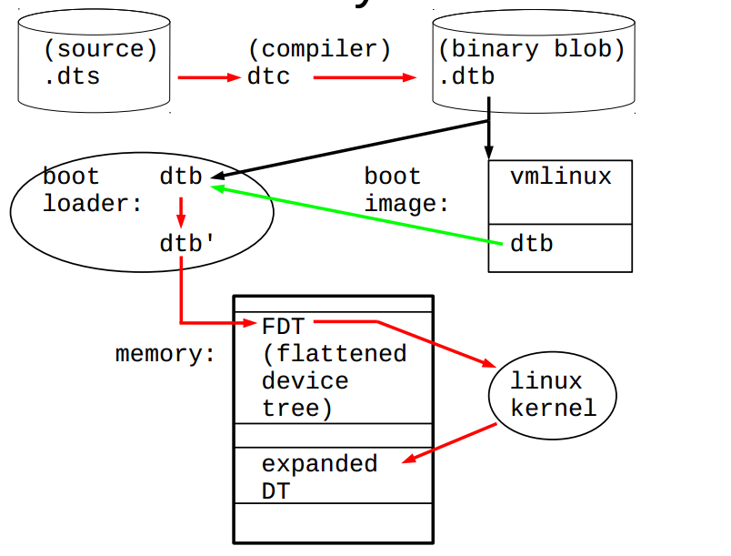

# Device Tree

https://www.kernel.org/doc/Documentation/devicetree/usage-model.txt

The “ Open Firmware Device Tree” , or simply Device Tree (DT), is a data
structure and language for describing hardware. More specifically, it is a
description of hardware that is readable by an operating system
so that the operating system doesn’t need to hard code details of the
machine.

提供一种语言来解耦硬件配置信息

- 最早： 2005 PowerPC Linux
- 现在： arm, microblaze, mips, powerpc, sparc, x86 Openrisc, c6x
        X86: arch/x86/platform/ce4100 (intel凌动处理器)

## 设备端：

使用设备树之前, 硬件的描述信息放置到一个个arch/xxx/mach-xxx/board-xxx.c的C文件中,例如下面的程序

```c
static struct resource dm9000_resource1[] = {
    {
    .start = 0x20100000,
    .end = 0x20100000 + 1,
    .flags = IORESOURCE_MEM
    …
    .start = IRQ_PF15,
    .end = IRQ_PF15,
    .flags = IORESOURCE_IRQ | IORESOURCE_IRQ_HIGHEDGE
    }
};

static struct platform_device dm9000_device1 = {
    .name = "dm9000",
    .id = 0,
    .num_resources = ARRAY_SIZE(dm9000_resource1),
    .resource = dm9000_resource1,
};

static struct platform_device *ip0x_devices[] __initdata = {
    &dm9000_device1,
    &dm9000_device2,
};
static int __init ip0x_init(void)
{
    platform_add_devices(ip0x_devices, ARRAY_SIZE(ip0x_devices));
}
```

由于硬件的信息使用代码描述 Linus 发邮件给 ARM 社区

```bash
ARM: F*cking pain in the ass

Gaah. Guys, this whole ARM thing is a
f*cking pain in the ass.

Linus, 2011,
http://lkml.org/lkml/2011/3/17/492
```

使用设备树之后， 硬件的描述信息，放置到一个个arch/xxx/boot/dts目录的.dtsi和.dts文件中 arch/powerpc/boot/dts 和 arch/arm/boot/dts

使用了设备树之后就可以很好的用 DTS 进行描述硬件资源，驱动可以在 c 里实现

##　驱动端:

驱动从　DTS 读取硬件信息: drivers/xxx/

```c
static int dm9000_probe(struct platform_device *pdev)
{
    …
    db->addr_res = platform_get_resource(pdev, IORESOURCE_MEM, 0);
    db->data_res = platform_get_resource(pdev, IORESOURCE_MEM, 1);
    db->irq_res = platform_get_resource(pdev, IORESOURCE_IRQ, 0);
    …
}
static struct dm9000_plat_data *dm9000_parse_dt(struct device *dev)
{
    ...
    if (of_find_property(np, "davicom,ext-phy", NULL))
        pdata->flags |= DM9000_PLATF_EXT_PHY;
    if (of_find_property(np, "davicom,no-eeprom", NULL))
        pdata->flags |= DM9000_PLATF_NO_EEPROM;
    mac_addr = of_get_mac_address(np);
    ...
}
static struct platform_driver dm9000_driver = {
    .driver = {
    .name = "dm9000",
    .pm = &dm9000_drv_pm_ops,
    .of_match_table = of_match_ptr(dm9000_of_matches),
    },
    .probe = dm9000_probe,
    .remove = dm9000_drv_remove,
};
```

## ARM设备树支持的相关补丁

下面是关于 ARM 内核支持 DTS 的补丁，因为内核已经支持了，所以对 ARM 的更改很小

```bash
2011-07-25 arm/dt: Add dtb make rule Rob Herring2-0/+13
2011-07-25 arm/dt: Add skeleton dtsi file Grant Likely1-0/+13
2011-07-25 arm/dt: Add dt machine definition Grant Likely1-0/+7
2011-05-23 arm/dt: probe for platforms via the device tree Grant Likely6-4/+135
2011-05-23 arm/dt: consolidate atags setup into setup_machine_atags Grant Likely2-29/+47
2011-05-11 arm/dt: Allow CONFIG_OF on ARM Grant Likely7-1/+92
2011-05-11 arm/dt: Make __vet_atags also accept a dtb image Grant Likely2-10/+22
```

## dtsi 和 dts

在 DTS 中底层是可以覆盖上层属性的，dtsi 共享的配置， 具体到硬件的 DTS 是可以覆盖引用的 dtsi 的设置

由 dtb 文件通过 kernel 解析为 device_node 结构体



PDF: Frank Rowand, devicetree: kernel internals and practical troubleshooting

## 脚本、代码、文档

引入了 DTS 以后，就可以分文三个概念： 脚本、代码、文档

- 脚本 -- .dts 文件节点的描述信息
- 代码 -- .c 代码 对应驱动的实现，驱动读取脚本的节点信息
- 文档 -- DT binding 文档，描述了怎么设置 DTS 文件和作用

## bool 节点属性的来龙去脉

代码：

```c
//drivers/mmc/core/host.c
cd_cap_invert = of_property_read_bool(np, "cd-inverted");
ro_cap_invert = of_property_read_bool(np, "wp-inverted");
```

脚本：

```c
//omap5-sbc-t54.dts
&mmc1 {
    ...
    cd-inverted;
    wp-inverted;
    ...
};
```

文档：

```bash
Documentation/devicetree/bindings/mmc/mmc.txt

- cd-inverted: when present, polarity on
the CD line is inverted. See the note
below for the case, when a GPIO is used
for the CD line
- wp-inverted: when present, polarity on
the WP line is inverted. See the note
below for the case, when a GPIO is used
for the WP line
```

## u32 数组节点属性的来龙去脉

```c
// 代码：
// arch/arm/mm/cache-l2x0.c
of_property_read_u32_array(np, "arm,data-latency",data, ARRAY_SIZE(data));

// 脚本：
// tegra30.dtsi
arm,data-latency = <6 6 2>;

// 文档：
// Documentation/devicetree/bindings/arm/l2cc.txt

- arm,data-latency : Cycles of latency for
Data RAM accesses. Specifies 3 cells of
read, write and setup latencies. Minimum
valid values are 1. Controllers without
setup latency control should use a value of 0.
```

## 各种of API

关于更多的 of API 可以参看 include/linux/of.h

## 设备树数据的三大作用

| 作用   　| 描述                              |
|---------|----------------------------------|
| 1. 平台标识  <br/>  platform identification | 用DT来标识特定的machine；<br/>root节点的compatible字段，匹配machine_desc的dt_compat比如：<br/>     compatible = "ti,omap3-beagleboard", "ti,omap3450", "ti,omap3"; |
| 2. 运行时配置<br/> runtime configuration | chosen节点的属性 <br/>     chosen { <br/>    bootargs = "console=ttyS0,115200 <br/>    loglevel=8";<br/>    initrd-start = <0xc8000000>;<br/>    initrd-end = <0xc8200000>;<br/>    }; |
| 3. 设备信息集合 <br/>    device population | serial@70006300 {<br/> // "厂家, 型号" 硬件的厂家 <br/>    compatible = "nvidia,tegra20-uart"; <br/>     reg = <0x70006300 0x100>;<br/>    interrupts = <122>;<br/>    };|

### 1. 平台标识 -- platform identification

通过搜索 DT_MACHINE 可以找到很多关于平台标识的信息

下面以 mach-exynos/exynos.c 为例展示：

```c
static char const *const exynos_dt_compat[] __initconst = {
        "samsung,exynos3",
        "samsung,exynos3250",
        "samsung,exynos4",
        "samsung,exynos4210",
        "samsung,exynos4212",
        "samsung,exynos4412",
        "samsung,exynos5",
        "samsung,exynos5250",
        "samsung,exynos5260",
        "samsung,exynos5420",
        "samsung,exynos5440",
        NULL
};

static void __init exynos_dt_fixup(void)
{
        /*
         * Some versions of uboot pass garbage entries in the memory node,
         * use the old CONFIG_ARM_NR_BANKS
         */
        of_fdt_limit_memory(8);
}

DT_MACHINE_START(EXYNOS_DT, "SAMSUNG EXYNOS (Flattened Device Tree)")
        /* Maintainer: Thomas Abraham <thomas.abraham@linaro.org> */
        /* Maintainer: Kukjin Kim <kgene.kim@samsung.com> */
        .l2c_aux_val    = 0x3c400001,
        .l2c_aux_mask   = 0xc20fffff,
        .smp            = smp_ops(exynos_smp_ops),
        .map_io         = exynos_init_io,
        .init_early     = exynos_firmware_init,
        .init_irq       = exynos_init_irq,
        .init_machine   = exynos_dt_machine_init,
        .init_late      = exynos_init_late,
        .dt_compat      = exynos_dt_compat,
        .dt_fixup       = exynos_dt_fixup,
MACHINE_END

// 在系统初始化时可以通过 of_machine_is_compatible 对具体平台做相应的定制设置
static void __init exynos_dt_machine_init(void)
{
        /*
         * This is called from smp_prepare_cpus if we've built for SMP, but
         * we still need to set it up for PM and firmware ops if not.
         */
        if (!IS_ENABLED(CONFIG_SMP))
                exynos_sysram_init();

#if defined(CONFIG_SMP) && defined(CONFIG_ARM_EXYNOS_CPUIDLE)
        if (of_machine_is_compatible("samsung,exynos4210") ||
            of_machine_is_compatible("samsung,exynos3250"))
                exynos_cpuidle.dev.platform_data = &cpuidle_coupled_exynos_data;
#endif
        if (of_machine_is_compatible("samsung,exynos4210") ||
            of_machine_is_compatible("samsung,exynos4212") ||
            (of_machine_is_compatible("samsung,exynos4412") &&
             of_machine_is_compatible("samsung,trats2")) ||
            of_machine_is_compatible("samsung,exynos3250") ||
            of_machine_is_compatible("samsung,exynos5250"))
                platform_device_register(&exynos_cpuidle);
}
```

关于 DT_MACHINE 的 hook 有很多函数需要在系统启动的时候进行调用，进而读取 DTS 文件的信息


### 2. 运行时配置 -- runtime configuration

U-Boot 修改 dtb : uboot 会修改 DTS 中 chosen 节点的内容

其中包括用户设置的 bootargs, initrd-start and initrd-end

```c
int fdt_chosen(void *fdt)
{
	int   nodeoffset;
	int   err;
	char  *str;		/* used to set string properties */

	err = fdt_check_header(fdt);
	if (err < 0) {
		printf("fdt_chosen: %s\n", fdt_strerror(err));
		return err;
	}

	/* find or create "/chosen" node. */
	nodeoffset = fdt_find_or_add_subnode(fdt, 0, "chosen");
	if (nodeoffset < 0)
		return nodeoffset;

	str = env_get("bootargs");
	if (str) {
		err = fdt_setprop(fdt, nodeoffset, "bootargs", str,
				  strlen(str) + 1);
		if (err < 0) {
			printf("WARNING: could not set bootargs %s.\n",
			       fdt_strerror(err));
			return err;
		}
	}

	return fdt_fixup_stdout(fdt, nodeoffset);
}
```

### 3. 设备信息 - device population

customize_machine() 或者 init_machine() 会调用 of_platform_populate() 函数会为 "simple-bus" 节点生成和展开 platform_device, 最终通过 of_device_alloc 生成的 platform_device

```c
/**
 * of_device_alloc - Allocate and initialize an of_device
 * @np: device node to assign to device
 * @bus_id: Name to assign to the device.  May be null to use default name.
 * @parent: Parent device.
 */
```

设备信息 -展开i2c子节点

    i2c_register_adapter() 函数会调用 of_i2c_register_devices()
    生成和展开 i2c device

```c
static struct i2c_client *of_i2c_register_device(struct i2c_adapter *adap, struct device_node *node)
{
    ...
    if (of_modalias_node(node, info.type, sizeof(info.type)) < 0) {
        ...
    }
    addr = of_get_property(node, "reg", &len);
    ...
    info.addr = be32_to_cpup(addr);
    ...
    result = i2c_new_device(adap, &info);
    ...
    return result;
}
```

设备信息 -展开spi子节点

    spi_register_master() 函数会调用 of_register_spi_devices()
    为子节点生成和展开spi device

```c
static void of_register_spi_devices(struct spi_master *master)
{
    …
    for_each_available_child_of_node(master->dev.of_node, nc) {
        spi = of_register_spi_device(master, nc);
        if (IS_ERR(spi))
            dev_warn(&master->dev, "Failed to create SPI device for %s\n",
                    nc->full_name);
    }
}

static struct spi_device *of_register_spi_device(struct spi_master *master, struct device_node *nc)
{
    rc = of_property_read_u32(nc, "reg", &value);
    if (rc) {
    dev_err(&master->dev, "%s has no valid 'reg' property (%d)\n",
    nc->full_name, rc);
    goto err_out;
    }
    spi->chip_select = value;
    rc = spi_add_device(spi);
    …
}
```

各级设备的展开


总线match函数

    platform_match() --> of_driver_match_device(dev, drv)

## reg

DTS 中编码地址信息：

    reg
    #address-cells
    #size-cells

其中 reg 的组织形式为 reg = <address1 length1 [address2 length2] [address3 length3] ... >，
其中的每一组 address length 表明了设备使用的一个地址范围。 address 为 1 个或多个 32 位
的整型（ 即 cell），而 length 则为 cell 的列表或者为空（若#size-cells = 0）。 address 和
length 字段是可变长的， 父结点的#address-cells 和#size-cells 分别决定了子结点的 reg 属性
的 address 和 length 字段的长度。 在本例中， root 结点的#address-cells = <1>;和#size-cells =
<1>;决定了 serial、 gpio、 spi 等结点的 address 和 length 字段的长度分别为 1。 cpus 结点的
#address-cells = <1>;和#size-cells = <0>;决定了 2 个 cpu 子结点的 address 为 1，而 length 为
空，于是形成了 2 个 cpu 的 reg = <0>;和 reg = <1>;。 external-bus 结点的#address-cells = <2>
和#size-cells = <1>;决定了其下的 ethernet、 i2c、 flash 的 reg 字段形如 reg = <0 0 0x1000>;、
reg = <1 0 0x1000>;和 reg = <2 0 0x4000000>;。 其中， address 字段长度为 0，开始的第一个
cell（ 0、 1、 2）是对应的片选，第 2 个 cell（ 0， 0， 0）是相对该片选的基地址，第 3 个
cell（ 0x1000、 0x1000、 0x4000000）为 length。 特别要留意的是 i2c 结点中定义的 #addresscells = <1>;和#size-cells = <0>;又作用到了 I2C 总线上连接的 RTC，它的 address 字段为
0x58，是设备的 I2C 地址。

## ranges

ranges 是地址转换表， 其中的每个项目是一个子地址、 父地址以及在子地址空间的大
小的映射。 映射表中的子地址、父地址分别采用子地址空间的#address-cells 和父地址空间
的#address-cells 大小。

- ranges 代表 local 地址映射向 parent 地址的转换
    ranges(loacal, parent, size)
- ranges 为空代表 1:1 映射
- 无 range 代表不是 memory map 区域

## 中断

对于中断控制器而言，它提供如下属性：

- interrupt-controller – 这个属性为空，中断控制器应该加上此属性表明自己的身份；
- #interrupt-cells – 与#address-cells 和 #size-cells 相似，它表明连接此中断控制器的设备的interrupts 属性的 cell 大小
- interrupt-parent – 设备结点透过它来指定它所依附的中断控制器的 phandle，当结点没有指定 interrupt-parent 时，则从父级结点继承。对于本例而言， root 结点指定了 interruptparent = <&intc>;其对应于 intc: interrupt-controller@10140000，而 root 结点的子结点并未指定 interrupt-parent，因此它们都继承了 intc，即位于 0x10140000 的中断控制器。
- interrupts – 用到了中断的设备结点透过它指定中断号、触发方法等，具体这个属性含有多少个 cell，由它依附的中断控制器结点的#interrupt-cells 属性决定。 而具体每个 cell 又是什么含义，一般由驱动的实现决定，而且也会在 Device Tree 的 binding 文档中说明。

对于 ARM GIC 中断控制器而言， #interrupt-cells 为 3，它 3 个 cell 的具体含义 Documentation/devicetree/bindings/interrupt-controller/arm,gic-v3.txt

```text
The 1st cell is the interrupt type; 0 for SPI interrupts, 1 for PPI
interrupts. Other values are reserved for future use.

The 2nd cell contains the interrupt number for the interrupt type.
SPI interrupts are in the range [0-987]. PPI interrupts are in the
range [0-15].

The 3rd cell is the flags, encoded as follows:
  bits[3:0] trigger type and level flags.
      1 = edge triggered
      4 = level triggered

The 4th cell is a phandle to a node describing a set of CPUs this
interrupt is affine to. The interrupt must be a PPI, and the node
pointed must be a subnode of the "ppi-partitions" subnode. For
interrupt types other than PPI or PPIs that are not partitionned,
this cell must be zero. See the "ppi-partitions" node description
below.
```

Documentation/devicetree/bindings/interrupt-controller/arm,gic.txt

```text
 The 1st cell is the interrupt type; 0 for SPI interrupts, 1 for PPI
 interrupts.

 The 2nd cell contains the interrupt number for the interrupt type.
 SPI interrupts are in the range [0-987].  PPI interrupts are in the
 range [0-15].

 The 3rd cell is the flags, encoded as follows:
   bits[3:0] trigger type and level flags.
       1 = low-to-high edge triggered
       2 = high-to-low edge triggered (invalid for SPIs)
       4 = active high level-sensitive
       8 = active low level-sensitive (invalid for SPIs).
   bits[15:8] PPI interrupt cpu mask.  Each bit corresponds to each of
   the 8 possible cpus attached to the GIC.  A bit set to '1' indicated
   the interrupt is wired to that CPU.  Only valid for PPI interrupts.
   Also note that the configurability of PPI interrupts is IMPLEMENTATION
   DEFINED and as such not guaranteed to be present (most SoC available
   in 2014 seem to ignore the setting of this flag and use the hardware
   default value).
```

## GPIO,DMA, CLK， pinctrl描述方式

```c
// arch/arm/boot/dts/am33xx.dtsi
gpio0: gpio@44e07000 {
    compatible = "ti,omap4-gpio";
    ti,hwmods = "gpio1";
    gpio-controller;
    #gpio-cells = <2>;
    interrupt-controller;
    #interrupt-cells = <2>;
    reg = <0x44e07000 0x1000>;
    interrupts = <96>;
};

// arch/arm/boot/dts/am335x-shc.dts
&mmc1 {
    pinctrl-names = "default";
    pinctrl-0 = <&mmc1_pins>;
    bus-width = <0x4>;
    cd-gpios = <&gpio0 6 GPIO_ACTIVE_HIGH>;
    cd-inverted;
    max-frequency = <26000000>;
    vmmc-supply = <&vmmcsd_fixed>;
    status = "okay";
};

// 通过 of_get_named_gpio 接口读取　GPIO 的信息
// drivers/mmc/host/sdhci-spear.c:51:      cd_gpio = of_get_named_gpio(np, "cd-gpios", 0);
// drivers/mmc/host/mxcmmc.c:1074:                 && !of_property_read_bool(pdev->dev.of_node, "cd-gpios"))
// drivers/mmc/host/sdhci-s3c.c:449:       if (of_get_named_gpio(node, "cd-gpios", 0))
// drivers/mmc/host/sdhci-sirf.c:185:              gpio_cd = of_get_named_gpio(pdev->dev.of_node, "cd-gpios", 0);
// drivers/mmc/host/pxamci.c:614:          of_get_named_gpio(np, "cd-gpios", 0);
// drivers/mmc/host/atmel-mci.c:685:                       of_get_named_gpio(cnp, "cd-gpios", 0);

```

## 反编译dtb

fdtdump linux-soc.dtb 或者 dtc -I dtb -O dts ….
