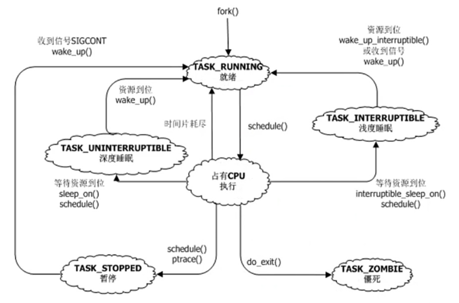

# Linux 进程，线程和调度 ---- 初篇

## 1. task_struct以及task_struct之间的关系

Linux进程是什么？

进程是一个资源管理的单位， 线程是一个调度单位

不同操作系统的资源管理由进程控制块PCB来进行表示，在Linux里面是用的 task_struct 表示的

```c
struct task_struct {
    //...
    struct mm_struct                *mm; // 内存资源
    pid_t                           pid;
    //...
    /* Filesystem information: */
    struct fs_struct                *fs;  // 文件系统资源

    /* Open file information: */
    struct files_struct             *files; // 打开文件资源
    //...
    /* Signal handlers: */
    struct signal_struct            *signal; // 信号处理资源
    struct sighand_struct           *sighand;
}；

// 内存管理的主要的结构体
struct mm_struct {
    struct vm_area_struct *mmap;            /* list of VMAs */
    ...
    pgd_t * pgd;
};

// 文件系统相关的结构体，主要有进程的根路径，和当前路径
struct fs_struct {
        int users;
        spinlock_t lock;
        seqcount_t seq;
        int umask;
        int in_exec;
        struct path root, pwd;
} __randomize_layout;

/*
 * Open file table structure
 */
struct files_struct {
  /*
   * read mostly part
   */
    atomic_t count;
    bool resize_in_progress;
    wait_queue_head_t resize_wait;

    struct fdtable __rcu *fdt;
    struct fdtable fdtab;
  /*
   * written part on a separate cache line in SMP
   */
    spinlock_t file_lock ____cacheline_aligned_in_smp;
    unsigned int next_fd;
    unsigned long close_on_exec_init[1];
    unsigned long open_fds_init[1];
    unsigned long full_fds_bits_init[1];
    struct file __rcu * fd_array[NR_OPEN_DEFAULT];  // 打开的文件列表
    // NR_OPEN_DEFAULT 定义系统默认打开的文件数量
};

/*
 * The default fd array needs to be at least BITS_PER_LONG,
 * as this is the granularity returned by copy_fdset().
 */
#define NR_OPEN_DEFAULT BITS_PER_LONG

/*
 * These aren't exported outside the kernel to avoid name space clashes
 */

#define BITS_PER_LONG 32
```

fork 炸弹 ---- 耗尽 Linux 内核的 pid 数量

```bash
# 查看系统最大支持的 pid 数量
cat /proc/sys/kernel/pid_max

# :() 是一个函数，在函数里面调用自己， ； 表示 ： 函数定义介绍，最后一个 ： 是调用该函数
:(){:|:&};:

# 显示每个用户的 PID 数量的限制
ulimit -u

# 查看更多的限制
ulimit -a
```

Linux task_stuct 的管理：

1. 链表 ---- 遍历
2. 树   ---- 查找父进程时使用
3. 哈希表 pid->task_struct 通过 PID 可以快速查找到对应进程的 task_stuct

pstree 可以查看进程树的情况

```bash
systemd─┬─ModemManager───2*[{ModemManager}]
        ├─NetworkManager─┬─dhclient
        │                └─2*[{NetworkManager}]
        ├─accounts-daemon───2*[{accounts-daemon}]
        ├─acpid
        ├─avahi-daemon───avahi-daemon
        ├─boltd───2*[{boltd}]
        ├─colord───2*[{colord}]
        ├─containerd───16*[{containerd}]
        ├─cron
        ├─cups-browsed───2*[{cups-browsed}]
        ├─cupsd
        ├─2*[dbus-daemon]
        ├─dnsmasq───dnsmasq
        ├─dockerd───15*[{dockerd}]
        ├─fcitx───{fcitx}
        ├─fcitx-dbus-watc
        ├─firefox─┬─3*[Web Content───24*[{Web Content}]]
        │         ├─Web Content───26*[{Web Content}]
        │         ├─WebExtensions───25*[{WebExtensions}]
        │         └─66*[{firefox}]
        ├─fwupd───4*[{fwupd}]
```

## 2. Linux进程生命周期(就绪、运行、睡眠、停止、僵死)



- 就绪态 <--> 运行态

进程一旦被fork出来就处于就绪态，一旦拿到的cpu就处于运行态，实际上在内核里面就绪和运行的状态标志是一样的。
但是进程不能老是一直占有cpu，也可能让给别人，所以运行态也可能切回就绪态。有两种可能性，
(1)时间片用完（分时调度），(2)时间片没用完但是被更紧急的事件抢占。

- 运行态 --> 睡眠态

进程处于运行态经常需要等待资源，如串口，网络发包，等资源不可能一直占有cpu死等，必须把进程切换睡眠态。

睡眠分为深度睡眠和浅度睡眠，深度睡眠指必须等到资源才会醒，浅度睡眠指资源来了也会醒，信号(singal)来了也会醒。

- 睡眠态 --> 就绪态

一旦等到了资源，切换就绪态

- 运行态 --> 僵尸

进程刚死时会变成僵尸，在linux下任何一个进程死时，不是人间蒸发，都会变成僵尸。

- 运行态 --> 停止态

停止态指进程在运行的过程中不去睡眠人为的让它停止，一般是发stop信号(ctrl +z ),或者是gdb attach debug调试。

- 停止态 --> 就绪态

给停止态发送continue信号即可到就绪态。

调度算法是在 ： 就绪态 和 运行态，也就是图里面的 就绪 和 占有，在 Linux 里状态标记都是 TASK_RUNNING

## ３. 僵尸是个什么鬼？

下面一个例子解释子进程被 kill 掉之后父进程清理的过程

```c
#include <stdio.h>
#include <sys/wait.h>
#include <stdlib.h>
#include <unistd.h>

int main(void)
{
    pid_t pid,wait_pid;
    int status;

    pid = fork();

    if (pid==-1) {
        perror("Cannot create new process");
        exit(1);
    } else if (pid==0) {
        printf("child process id: %ld\n", (long) getpid());
        pause();
        _exit(0);
    } else {
        #if 1
        /* define 1 to make child process always a zomie */
        printf("ppid:%d\n", getpid());
        while(1);
        #endif
        do {
            /* 子进程死 waitpid就返回，status保存子进程退出原因 */
            wait_pid=waitpid(pid, &status, WUNTRACED | WCONTINUED);

            if (wait_pid == -1) {
                perror("cannot using waitpid function");
                exit(1);
            }

            if (WIFEXITED(status))
                printf("child process exites, status=%d\n", WEXITSTATUS(status));

            if(WIFSIGNALED(status))
                printf("child process is killed by signal %d\n", WTERMSIG(status));

            if (WIFSTOPPED(status))
                printf("child process is stopped by signal %d\n", WSTOPSIG(status));

            if (WIFCONTINUED(status))
                printf("child process resume running....\n");

        } while (!WIFEXITED(status) && !WIFSIGNALED(status));

        exit(0);
    }
}
```

下面这段代码是 Linux 内核如何处理僵尸进程的
```c
/*
 * Handle sys_wait4 work for one task in state EXIT_ZOMBIE.  We hold
 * read_lock(&tasklist_lock) on entry.  If we return zero, we still hold
 * the lock and this task is uninteresting.  If we return nonzero, we have
 * released the lock and the system call should return.
 */
static int wait_task_zombie(struct wait_opts *wo, struct task_struct *p)
{
        int state, status;
        pid_t pid = task_pid_vnr(p);
        uid_t uid = from_kuid_munged(current_user_ns(), task_uid(p));
        struct waitid_info *infop;

        if (!likely(wo->wo_flags & WEXITED))
                return 0;

        if (unlikely(wo->wo_flags & WNOWAIT)) {
                status = p->exit_code;  // 推出码在这里设置
                get_task_struct(p);
                read_unlock(&tasklist_lock);
                sched_annotate_sleep();
                if (wo->wo_rusage)
                        getrusage(p, RUSAGE_BOTH, wo->wo_rusage);
                put_task_struct(p);
                goto out_info;
        }
    // ...
}
```

僵尸可以通过 top/ps 查看， 僵尸进程是不能通过 kill -9 杀死的，只有杀死父进程才可以杀死

## 4. 内存泄漏的真实含义

不是进程死了，内存没释放

是进程活着，运行越久，消耗的内存越多

如何观察内存消耗情况？ 要采用多点采集观察法，正常的是在一条均线上震荡

## 5. 停止状态与作业控制， cpulimit

作业控制（Job Control）

通过 ctrl+z 可让进程暂停， fg/bg 可让进程继续执行

cpulimit 控制一个进程的cpu消耗。

```bash
# 查看系统支持的信号集合
kill -l

# 限制pid为 1000 程序的cpu使用率不超过20
cpulimit -l 20 -p 1000
```

cpulimit的原理是不断进程在 停止 和 运行 态之间来回切换，以此来降低cpu利用率

以后用 cgroup 进行控制
