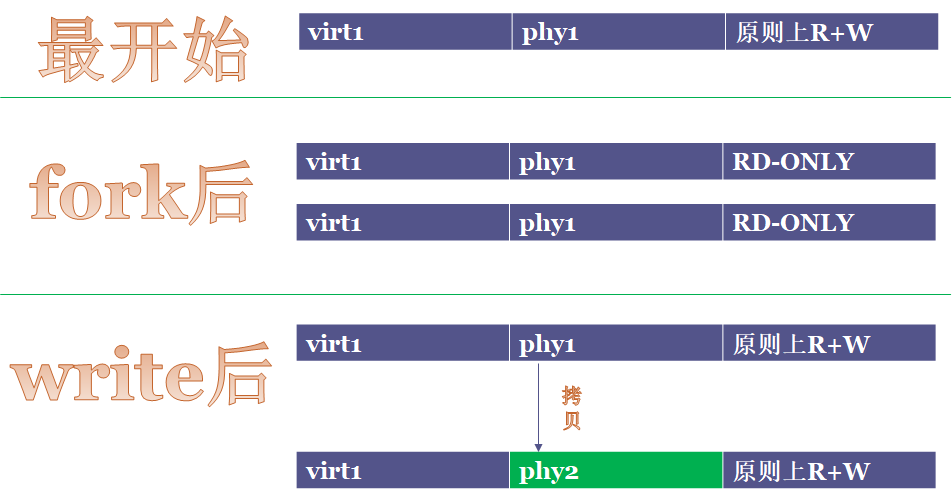
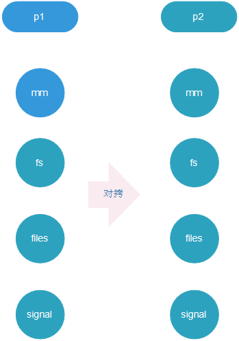
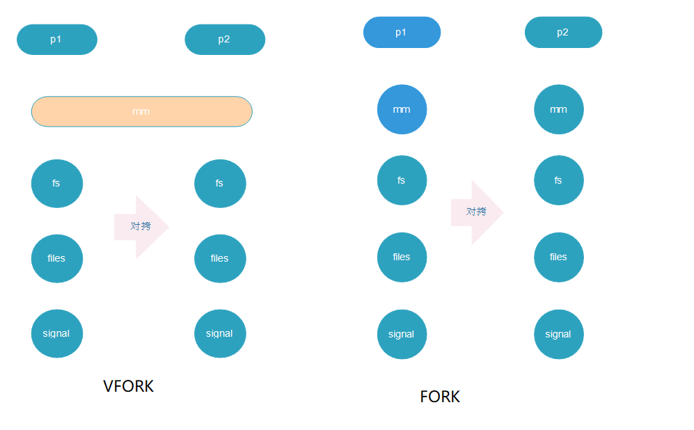
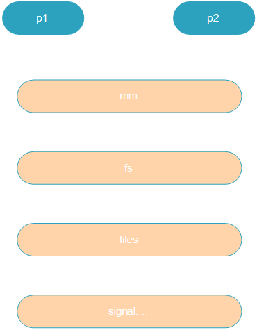
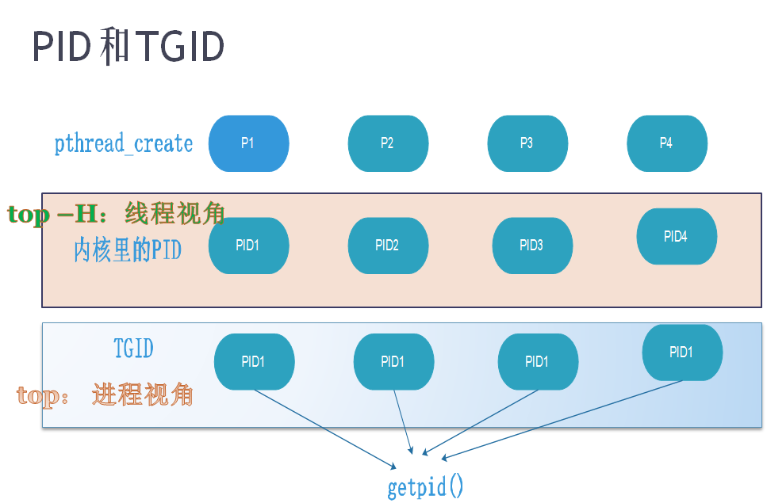
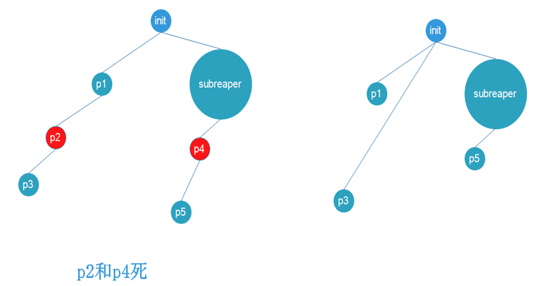
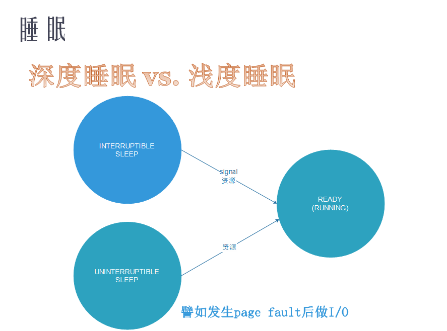

# Linux 进程，线程和调度 ---- 02

## 1. fork、 vfork、 clone

### 写时拷贝技术



从图中可以看出，在最开始阶段的时候，就是有一个进程在运行，并且虚拟地址是可读可写的

使用fork以后产生了子进程，子进程会拷贝父进程的信息，并且共享内存资源的信息，并把相应的共享虚拟地址标记为只读的状态。

任一一个进程 write 后，写进程会申请新的物理地址，并把共享的物理地址断开，并标记为 R+W，也就是 Copy On Write （COW）机制

这是的 P1 和 P2 的虚拟地址是一样的，就是物理地址不一样

### fork  以后的资源形式：

fork():

    1. SIGCHLD



最难分裂的是内存资源，内存资源分配需要 MMU

### vfork

在没有 MMU 的 Linux 系统中没有 fork ，只有使用 vfork

没有 Copy On Write， 没有 fork

使用 vfork ： 父进程阻塞知道子进程 exit 或者 exec

vfork():

    1. CLONE_VM
    2. CLONE_VFORK
    3. SIGCHLD

！[vfork](images/vfork.jpg)

fork 和 vfork 的不同：



```c
#include <stdio.h>
#include <sched.h>
#include <unistd.h>

int data = 10;

int child_process()
{
        printf("Child process %d, data %d\n",getpid(),data);
        data = 20;
        printf("Child process %d, data %d\n",getpid(),data);
        _exit(0);
}

int main(int argc, char* argv[])
{
        if(vfork() == 0) {
                child_process();
        } else {
                sleep(1);
                printf("Parent process %d, data %d\n",getpid(), data);
        }
}

```

### Clone

pthread_create -> clone 通过 clone_flags 传参，共享资源，可以调度的

    1. CLONE_VM
    2. CLONE_FS
    3. CLONE_FILES
    4. CLONE_SIGHAND
    5. CLONE_THREAD

线程也是 LWP 轻量级进程

clone 就是创建新的 task_struct 结构体



线程的 PID， POSIX 标准统一个进程穿件的线程使用同一个 PID，在内核里增加了一个 tgid (thread group ID)



```C
// 编译 gcc thread.c -pthread, 用 strace ./a.out 跟踪其对 clone() 的调用
// ls /proc/$pid/task/  查看 线程ID
// gettid 可以通过系统调用得到 线程ID
// pthread_self 只是拿到用户态的一个编号
#include <stdio.h>
#include <pthread.h>
#include <stdio.h>
#include <linux/unistd.h>
#include <sys/syscall.h>

static pid_t gettid( void )
{
        return syscall(__NR_gettid);
}

static void *thread_fun(void *param)
{
        printf("thread pid:%d, tid:%d pthread_self:%lu\n", getpid(),   gettid(), pthread_self());
        while(1);
        return NULL;
}

int main(void)
{
        pthread_t tid1, tid2;
        int ret;

        printf("thread pid:%d, tid:%d pthread_self:%lu\n", getpid(), gettid(),pthread_self());

        ret = pthread_create(&tid1, NULL, thread_fun, NULL);
        if (ret == -1) {
                perror("cannot create new thread");
                return -1;
        }

        ret = pthread_create(&tid2, NULL, thread_fun, NULL);
        if (ret == -1) {
                perror("cannot create new thread");
                return -1;
        }

        if (pthread_join(tid1, NULL) != 0) {
                perror("call pthread_join function fail");
                return -1;
        }

        if (pthread_join(tid2, NULL) != 0) {
                perror("call pthread_join function fail");
                return -1;
        }

        return 0;
}
```

## 2. 孤儿进程的托孤， SUBREAPER

在新的系统中不仅可以托孤给 init，也可以托孤给一个 subreaper 的进程



subreaper 进程要做一些事情

```c
/* Become reaper of our children */
if (prctl(PR_SET_CHILD_SUBREAPER, 1) < 0) {
    log_warning("Failed to make us a subreaper: %m");
    if (errno == EINVAL)
        log_info("Perhaps the kernel version is too old (<3.4?)");
}
```

PR_SET_CHILD_SUBREAPER 是 Linux 3.4 加入的新特性。把它设置为
非零值，当前进程就会变成 subreaper，会像 1 号进程那样收养孤儿进程
了

life-period例子，实验体会托孤

```c
// 编译运行 life_period.c，杀死父进程，用 pstree 命令观察子进程的被托孤
#include <stdio.h>
#include <sys/wait.h>
#include <stdlib.h>
#include <unistd.h>

int main(void)
{
	pid_t pid,wait_pid;
	int status;

	pid = fork();

	if (pid==-1)	{
		perror("Cannot create new process");
		exit(1);
	} else 	if (pid==0) {
		printf("child process id: %ld\n", (long) getpid());
		pause();
		_exit(0);
	} else {
		printf("parent process id: %ld\n", (long) getpid());
		wait_pid=waitpid(pid, &status, WUNTRACED | WCONTINUED);
		if (wait_pid == -1) {
			perror("cannot using waitpid function");
			exit(1);
		}

		if(WIFSIGNALED(status))
			printf("child process is killed by signal %d\n", WTERMSIG(status));

		exit(0);
	}
}
```

## 3. 进程的睡眠和等待队列

睡眠： 深度睡眠和浅度睡眠

深度睡眠： 不允许信号打断，只能通过资源来唤醒

浅度睡眠： 可以通过信号和资源来唤醒



内核里通常要等待资源时，要把 task_struct 挂载到等待队列上，资源来到时只需要唤醒等待队列就可以了

一下是进程是如何睡的，如何唤醒的

```c
static ssize_t globalfifo_read(struct file *filp, char __user *buf,
                   size_t count, loff_t *ppos)
static ssize_t globalfifo_write(struct file *filp, const char __user *buf,
                size_t count, loff_t *ppos)
```

彻底看懂等待队列的案例

```c
/*
 * a simple char device driver: globalfifo
 *
 * Copyright (C) 2014 Barry Song  (baohua@kernel.org)
 *
 * Licensed under GPLv2 or later.
 */

#include <linux/module.h>
#include <linux/types.h>
#include <linux/sched.h>
#include <linux/init.h>
#include <linux/cdev.h>
#include <linux/slab.h>
#include <linux/poll.h>
#include <linux/platform_device.h>
#include <linux/miscdevice.h>
#include <linux/of_device.h>

#define GLOBALFIFO_SIZE	0x1000
#define FIFO_CLEAR 0x1
#define GLOBALFIFO_MAJOR 231

struct globalfifo_dev {
	unsigned int current_len;
	unsigned char mem[GLOBALFIFO_SIZE];
	struct mutex mutex;
	wait_queue_head_t r_wait;
	wait_queue_head_t w_wait;
	struct fasync_struct *async_queue;
	struct miscdevice miscdev;
};

static int globalfifo_fasync(int fd, struct file *filp, int mode)
{
	struct globalfifo_dev *dev = container_of(filp->private_data,
		struct globalfifo_dev, miscdev);

	return fasync_helper(fd, filp, mode, &dev->async_queue);
}

static int globalfifo_open(struct inode *inode, struct file *filp)
{
       return 0;
}

static int globalfifo_release(struct inode *inode, struct file *filp)
{
	globalfifo_fasync(-1, filp, 0);
	return 0;
}

static long globalfifo_ioctl(struct file *filp, unsigned int cmd,
			     unsigned long arg)
{
	struct globalfifo_dev *dev = container_of(filp->private_data,
		struct globalfifo_dev, miscdev);

	switch (cmd) {
	case FIFO_CLEAR:
		mutex_lock(&dev->mutex);
		dev->current_len = 0;
		memset(dev->mem, 0, GLOBALFIFO_SIZE);
		mutex_unlock(&dev->mutex);

		printk(KERN_INFO "globalfifo is set to zero\n");
		break;

	default:
		return -EINVAL;
	}
	return 0;
}

static unsigned int globalfifo_poll(struct file *filp, poll_table * wait)
{
	unsigned int mask = 0;
	struct globalfifo_dev *dev = container_of(filp->private_data,
		struct globalfifo_dev, miscdev);

	mutex_lock(&dev->mutex);

	poll_wait(filp, &dev->r_wait, wait);
	poll_wait(filp, &dev->w_wait, wait);

	if (dev->current_len != 0) {
		mask |= POLLIN | POLLRDNORM;
	}

	if (dev->current_len != GLOBALFIFO_SIZE) {
		mask |= POLLOUT | POLLWRNORM;
	}

	mutex_unlock(&dev->mutex);
	return mask;
}

static ssize_t globalfifo_read(struct file *filp, char __user *buf,
			       size_t count, loff_t *ppos)
{
	int ret;
	struct globalfifo_dev *dev = container_of(filp->private_data,
		struct globalfifo_dev, miscdev);

	DECLARE_WAITQUEUE(wait, current);

	mutex_lock(&dev->mutex);
	add_wait_queue(&dev->r_wait, &wait);

	while (dev->current_len == 0) {
		if (filp->f_flags & O_NONBLOCK) {
			ret = -EAGAIN;
			goto out;
		}
		__set_current_state(TASK_INTERRUPTIBLE);
		mutex_unlock(&dev->mutex);

		schedule();
		if (signal_pending(current)) {
			ret = -ERESTARTSYS;
			goto out2;
		}

		mutex_lock(&dev->mutex);
	}

	if (count > dev->current_len)
		count = dev->current_len;

	if (copy_to_user(buf, dev->mem, count)) {
		ret = -EFAULT;
		goto out;
	} else {
		memcpy(dev->mem, dev->mem + count, dev->current_len - count);
		dev->current_len -= count;
		printk(KERN_INFO "read %d bytes(s),current_len:%d\n", count,
		       dev->current_len);

		wake_up_interruptible(&dev->w_wait);

		ret = count;
	}
 out:
	mutex_unlock(&dev->mutex);
 out2:
	remove_wait_queue(&dev->r_wait, &wait);
	set_current_state(TASK_RUNNING);
	return ret;
}

static ssize_t globalfifo_write(struct file *filp, const char __user *buf,
				size_t count, loff_t *ppos)
{
	struct globalfifo_dev *dev = container_of(filp->private_data,
		struct globalfifo_dev, miscdev);

	int ret;
	DECLARE_WAITQUEUE(wait, current);

	mutex_lock(&dev->mutex);
	add_wait_queue(&dev->w_wait, &wait);

	while (dev->current_len == GLOBALFIFO_SIZE) {
		if (filp->f_flags & O_NONBLOCK) {
			ret = -EAGAIN;
			goto out;
		}
		__set_current_state(TASK_INTERRUPTIBLE);

		mutex_unlock(&dev->mutex);

		schedule();
		if (signal_pending(current)) {
			ret = -ERESTARTSYS;
			goto out2;
		}

		mutex_lock(&dev->mutex);
	}

	if (count > GLOBALFIFO_SIZE - dev->current_len)
		count = GLOBALFIFO_SIZE - dev->current_len;

	if (copy_from_user(dev->mem + dev->current_len, buf, count)) {
		ret = -EFAULT;
		goto out;
	} else {
		dev->current_len += count;
		printk(KERN_INFO "written %d bytes(s),current_len:%d\n", count,
		       dev->current_len);

		wake_up_interruptible(&dev->r_wait);

		if (dev->async_queue) {
			kill_fasync(&dev->async_queue, SIGIO, POLL_IN);
			printk(KERN_DEBUG "%s kill SIGIO\n", __func__);
		}

		ret = count;
	}

 out:
	mutex_unlock(&dev->mutex);
 out2:
	remove_wait_queue(&dev->w_wait, &wait);
	set_current_state(TASK_RUNNING);
	return ret;
}

static const struct file_operations globalfifo_fops = {
	.owner = THIS_MODULE,
	.read = globalfifo_read,
	.write = globalfifo_write,
	.unlocked_ioctl = globalfifo_ioctl,
	.poll = globalfifo_poll,
	.fasync = globalfifo_fasync,
	.open = globalfifo_open,
	.release = globalfifo_release,
};

static int globalfifo_probe(struct platform_device *pdev)
{
	struct globalfifo_dev *gl;
	int ret;

	gl = devm_kzalloc(&pdev->dev, sizeof(*gl), GFP_KERNEL);
	if (!gl)
		return -ENOMEM;
	gl->miscdev.minor = MISC_DYNAMIC_MINOR;
	gl->miscdev.name = "globalfifo";
	gl->miscdev.fops = &globalfifo_fops;

	mutex_init(&gl->mutex);
	init_waitqueue_head(&gl->r_wait);
	init_waitqueue_head(&gl->w_wait);
	platform_set_drvdata(pdev, gl);

	ret = misc_register(&gl->miscdev);
	if (ret < 0)
		goto err;

	dev_info(&pdev->dev, "globalfifo drv probed\n");
	return 0;
err:
	return ret;
}

static int globalfifo_remove(struct platform_device *pdev)
{
	struct globalfifo_dev *gl = platform_get_drvdata(pdev);

	misc_deregister(&gl->miscdev);

	dev_info(&pdev->dev, "globalfifo drv removed\n");
	return 0;
}

static struct platform_driver globalfifo_driver = {
	.driver = {
		.name = "globalfifo",
		.owner = THIS_MODULE,
	},
	.probe = globalfifo_probe,
	.remove = globalfifo_remove,
};

module_platform_driver(globalfifo_driver);

MODULE_AUTHOR("Barry Song <baohua@kernel.org>");
MODULE_LICENSE("GPL v2");
```

## 4. 进程0 和 进程1

进程0 是 IDLE 进程，等没有进程运行的时候，进程0才运行，优先级是最低的，在进程0运行时会进入低功耗模式

进程1 的父进程就是 进程0
